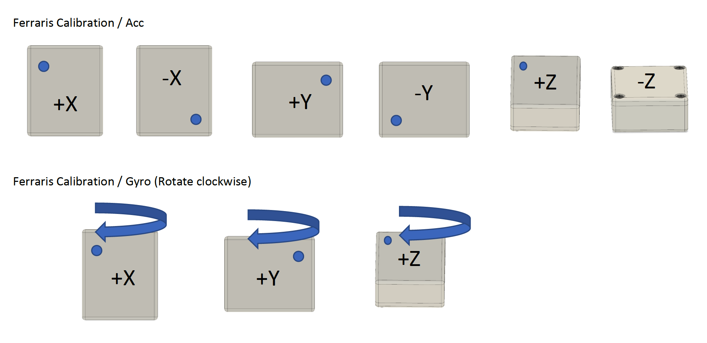

.. _ferraris_guide:

========================================
Ferraris Calibration - A practical guide
========================================

This guide will provide you a brief overview on how to perform a Ferraris Calibration and provide you with some
experience based best practices.

The Ferraris Calibration is a relatively simple calibration for 6 DOF IMUs as it only consists of placing the sensor
units on each side and rotating them around each axis.
These motions can either be performed entirely by hand or assisted by a turntable.
The method was first described by Ferraris et al. in 1994 (full text of the paper is hard to find online, but the
authors of this package might be able to help you with finding a copy).
Compared to directly calibrating the Gyroscope using a defined rate of rotation, this method uses a rotation of an fixed
angle.
This makes it feasible to perform the calibration without the use of expensive equipment.

What I need
===========

1. A 6 DOF sensor unit that can record or stream the raw IMU data.
2. (Optional) A calibration adapter for the IMU unit, if the sensor does not have flat perpendicular sides.
3. A flat and level surface
4. A fixed flat object (like a box) that can be used as rotation guide

Step by step
============

Before you start, you need to decide which directions the sensor axis (x, y, z) should have after the calibration.
It is not important, in which direction the actual "hardware" axis of the MEMS IMU point.
The calibration procedure will transform the "hardware" axis into the new calibrated coordinate system, independent of
the orientation.
Note, that the calibrated coordinate system must be right-handed.

1. Check that your surface is level and during the procedure avoid moving/bumping the surface
2. (Optional) Place the sensor unit in its calibration adapter.
   Make sure that it does not wobble and use the same orientation, when calibrating multiple sensor units.
3. Place the sensor on the flat surface in a way that the calibrated x-axis points upwards.
   In this configuration, mark the top left corner using a marker or a sticker.
   We will use it as guide for all further calibration positions (see image).
4. Prepare the sensor unit to record the calibration.
   You can either record each calibration position/motion as a separate recording or you can make a single large
   recording and use :func:`~imucal.ferraris_regions_from_interactive_plot` to mark the different sections after the
   recording.
   While the first option sounds like less manual work, it is more error prone and still requires some manual cleaning
   for the best possible results.
   Therefore, we suggest to use the second method.
5. Go through the calibration positions/motions shown below and record them with the IMU unit.
   Keep the sensor at least 3 seconds in each static position.
   To perform the rotations, press the sensor against a box to define a start position.
   Slowly move it forward a little, perform the rotation and press it against the box to mark the end position.
   This ensures that you really performed a rotation of 360 deg.
   Avoid, wobbling/tilting the sensor during the rotation.
   If this is difficult, consider designing calibration adapter with larger flat surfaces.
   This is the most sensitive part of the calibration.
   Therefore, go slow and consistent to avoid additional movements that should not be part of the rotation.
6. End your recording and load the data onto a PC.
   Then follow :ref:`the code part of this tutorial <basic_ferraris>`.

General Tips and Gotchas
========================

- Over time or due to changes in operating condition (e.g. change of temperature) a recalibration might be required.
  For the best results, calibrate close to your actual measurement under the same conditions.
  However, for many applications you will also get great results without such a rigorous calibration protocol.
- It is always advisable to perform sanity checks of the calculated results!
- For the rotations, make sure the final signal used for the calibration contains only the rotation and little to no
  resting or other movements before and after.
  Because the calibration uses an integration, such additional signals would introduce additional errors.
- If you have multiple sensors to calibrate, make sure you think of a way to store and retrieve the calibration
  information.
  For further information on this, read :ref:`our dedicated guide on this topic <cal_store_guide>`
- Be aware of the signal units before and after calibration.
  Some sensor units provide data in a raw format (voltage or bits) with no real unit (a.u.), while others will provide
  the data in physical units.
  Independent of the input, the Ferraris Calibration will find a transformation to convert these values to m/s^2 and
  deg/s (with the default settings).
  However, if the input was in some raw format, the calibration will depend on the configured range of the sensor,
  as these raw outputs are usually scaled accordingly.
  If you want to get a calibration that can be used independent of the sensor range, it is advisable to first convert
  the raw output into physical units using the conversion equations provided by the manufacturer and then refine the
  results using a calibration.
  In any case, you should record the used input units (from-units) with each calibration to avoid applying it to the
  wrong data.

